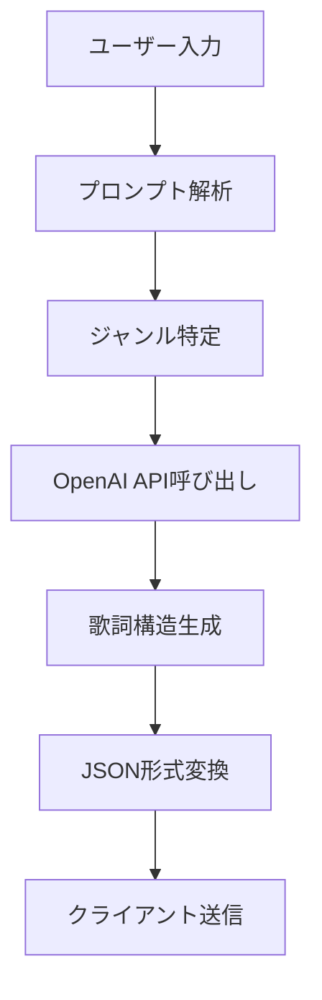
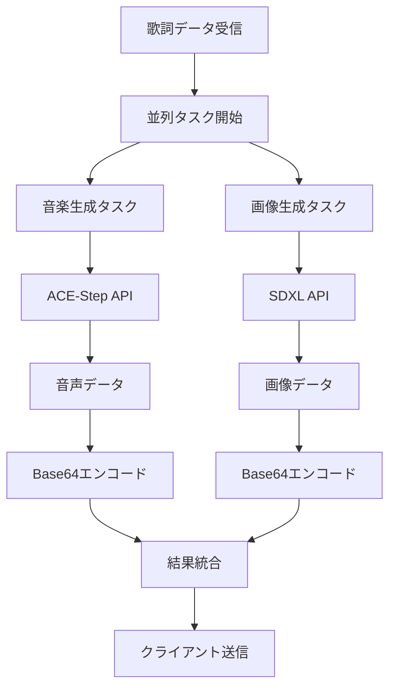
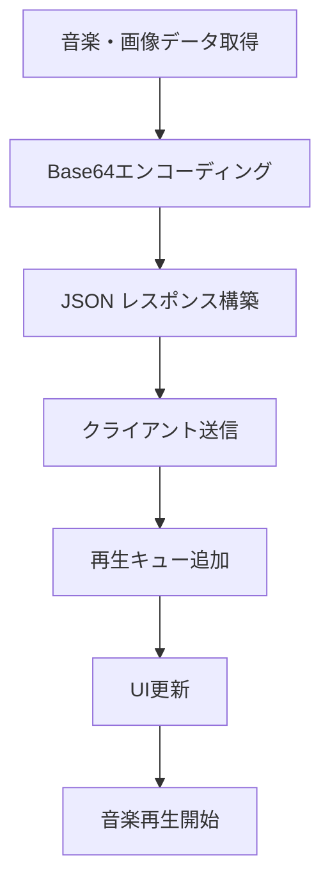
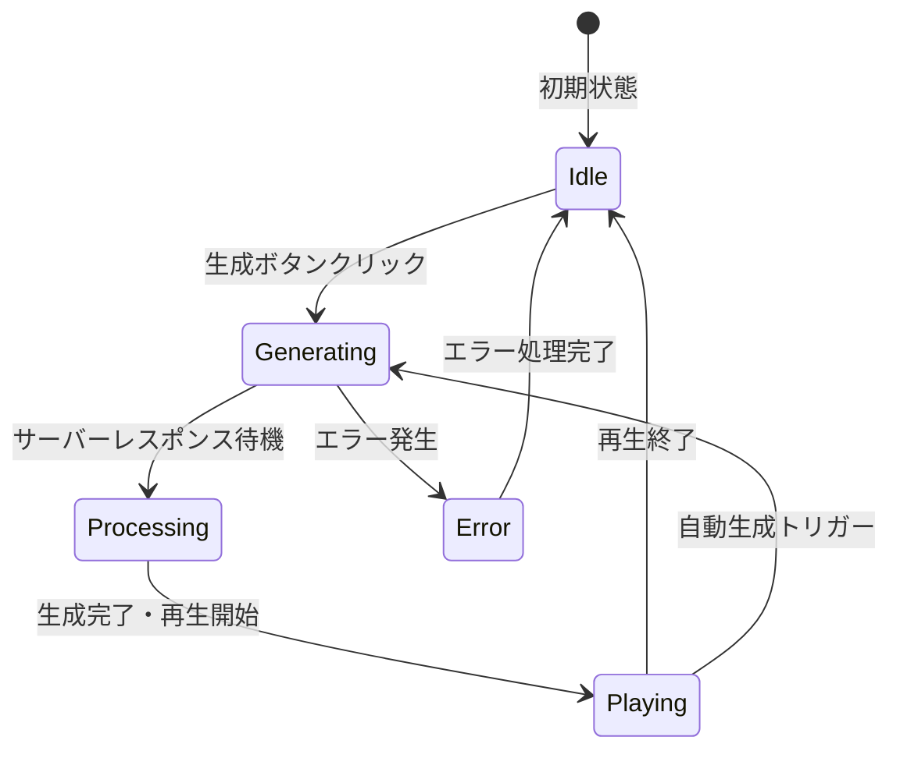

# Momo Song v3 - 詳細ドキュメント

## 概要

Momo Song v3は、AI技術を活用した総合的な音楽生成Webアプリケーションです。ユーザーの入力から歌詞、音楽、画像を自動生成し、完全なオリジナル楽曲を創出します。

## アプリケーション機能詳細

### 🎵 1. AI歌詞生成機能

**技術スタック:**
- OpenAI API (GPT-4/GPT-3.5)
- カスタムプロンプトエンジニアリング

**機能概要:**
- ユーザーの入力テキストから楽曲のテーマとムードを解析
- ジャンル特性を考慮した歌詞構造の自動生成
- Verse、Chorus、Bridgeなどのセクション別構成
- 感情表現と韻律を考慮した言葉選択

**生成される歌詞要素:**
- タイトル
- バース（Verse）
- コーラス（Chorus）
- ブリッジ（Bridge）
- アウトロ（Outro）

### 🎼 2. AI作曲機能

**技術スタック:**
- ACE-Step-direct API
- カスタムパラメータ調整

**音楽生成パラメータ:**
- `infer_step`: 推論ステップ数（20-200）
- `guidance_scale`: ガイダンススケール（1-50）
- `omega_scale`: オメガスケール（5-50）
- `no_vocal`: ボーカル有無フラグ

**対応音楽形式:**
- ボーカル付き楽曲
- インストゥルメンタル楽曲
- 多様なジャンル対応（ポップ、ジャズ、ロック、クラシックなど）

**出力形式:**
- MP3フォーマット
- Base64エンコーディング
- ブラウザ直接再生対応

### 🖼️ 3. AI画像生成機能

**技術スタック:**
- SDXL (Stable Diffusion XL)
- カスタムプロンプト生成

**画像生成特徴:**
- 楽曲の世界観を視覚化
- 歌詞とムードに基づいた画像プロンプト自動生成
- 複数のアスペクト比対応（16:9、4:3）
- 縦横両方向対応

**サポート解像度:**
- 16:9 横: 1296x728
- 16:9 縦: 728x1296
- 4:3 横: 1024x768
- 4:3 縦: 768x1024

### 🔄 4. 自動生成システム

**自動生成フロー:**
1. チェックボックス有効化で即座に生成開始
2. 60秒間の無操作検知
3. 自動的な次回生成トリガー
4. ユーザー操作による自動停止

**安全機能:**
- 重複生成防止
- エラー時の自動復旧
- リソース保護機構

## 詳細処理フロー

### Phase 1: 歌詞生成フェーズ



**詳細ステップ:**

1. **入力処理**
   - ユーザーテキスト取得
   - タイトル、ジャンル、ムード、楽器指定の統合
   - ボーカル有無フラグの処理

2. **プロンプト構築**
   ```python
   # 基本プロンプト
   base_prompt = user_input
   
   # 詳細パラメータ追加
   if title: full_prompt += f"\nタイトル: {title}"
   if genre: full_prompt += f"\nジャンル: {genre}"
   if mood: full_prompt += f"\nムード: {mood}"
   if instruments: full_prompt += f"\n楽器: {instruments}"
   
   # ボーカルなし対応
   if no_vocal:
       user_input = f"instrumental music, no vocal, {user_input}"
   ```

3. **OpenAI API実行**
   - 非同期処理による高速レスポンス
   - エラーハンドリング
   - リトライ機構

4. **歌詞構造化**
   ```json
   {
     "title": "楽曲タイトル",
     "lyrics": {
       "verse1": "第1バース歌詞",
       "chorus": "コーラス歌詞",
       "verse2": "第2バース歌詞",
       "bridge": "ブリッジ歌詞",
       "outro": "アウトロ歌詞"
     }
   }
   ```

### Phase 2: 並列生成フェーズ



**音楽生成詳細:**

1. **パラメータ設定**
   ```python
   audio_task = asyncio.to_thread(
       generate_song, 
       lyrics_dict, 
       infer_step,      # 推論精度
       guidance_scale,  # ガイダンス強度
       omega_scale,     # オメガ調整
       no_vocal        # ボーカル有無
   )
   ```

2. **ACE-Step-direct API呼び出し**
   - 歌詞データをプロンプトに変換
   - 音楽生成パラメータ適用
   - バイナリ音楽データ取得

**画像生成詳細:**

1. **画像プロンプト生成**
   ```python
   image_task = create_image(
       sdxl_url,      # SDXL APIエンドポイント
       a_client,      # OpenAIクライアント
       music_world,   # 楽曲世界観データ
       "text2image",  # 生成タイプ
       "t2i",         # モード指定
       height,        # 画像高さ
       width          # 画像幅
   )
   ```

2. **SDXL実行**
   - 楽曲の世界観を画像プロンプトに変換
   - SDXL APIによる画像生成
   - PIL画像オブジェクト取得

### Phase 3: データ統合・配信フェーズ



**データ変換処理:**

1. **画像データ変換**
   ```python
   buf = io.BytesIO()
   pil_image.save(buf, format='PNG')
   image_base64 = 'data:image/png;base64,' + base64.b64encode(buf.getvalue()).decode()
   ```

2. **音楽データ変換**
   ```python
   audio_base64 = 'data:audio/mp3;base64,' + base64.b64encode(audio_bytes).decode()
   ```

3. **統合レスポンス**
   ```json
   {
     "lyrics_json": "歌詞JSON文字列",
     "image_base64": "data:image/png;base64,iVBORw0KGgoAAAANSUhEUgAA...",
     "audio_base64": "data:audio/mp3;base64,SUQzBAAAAAAAI1RTU0UAAA..."
   }
   ```

## フロントエンド処理フロー

### UI状態管理



### 再生キューシステム

**キュー管理:**
```javascript
const playQueue = [];  // 再生待ちキュー
let isPlaying = false; // 再生状態フラグ
let isGenerating = false; // 生成状態フラグ
```

**キュー処理ロジック:**
1. 生成完了データをキューに追加
2. 現在再生中でなければ即座に再生開始
3. 再生終了時に次のキューアイテムを処理
4. キューが空の場合は待機状態に移行

### 自動生成システム詳細

**状態変数:**
```javascript
let autoGenerateEnabled = false;     // 自動生成有効フラグ
let lastUserAction = Date.now();     // 最終ユーザー操作時刻
const AUTO_GENERATE_IDLE = 60000;    // 自動生成待機時間（60秒）
let isAutoGenerating = false;        // 自動生成実行中フラグ
```

**監視ループ:**
```javascript
function checkAutoGenerateIdle() {
    if (autoGenerateEnabled && 
        Date.now() - lastUserAction >= AUTO_GENERATE_IDLE &&
        playQueue.length === 0) {
        triggerGenerate(); // 自動生成実行
    }
    setTimeout(checkAutoGenerateIdle, 3000); // 3秒ごとにチェック
}
```

## エラーハンドリング

### サーバーサイドエラー対応

1. **OpenAI API エラー**
   - 接続タイムアウト処理
   - レート制限対応
   - 代替プロンプト生成

2. **音楽生成API エラー**
   - ACE-Step API接続エラー
   - パラメータ不正エラー
   - 生成失敗時のリトライ

3. **画像生成API エラー**
   - SDXL API接続エラー
   - プロンプト長制限対応
   - 画像生成失敗時の代替画像

### クライアントサイドエラー対応

1. **ネットワークエラー**
   - 接続失敗時のユーザー通知
   - 自動リトライ機構
   - オフライン状態検知

2. **音声再生エラー**
   - ブラウザ互換性チェック
   - オーディオコンテキスト復旧
   - 代替再生方式

## パフォーマンス最適化

### 並列処理最適化

```python
# 音楽と画像の同時生成
audio_task = asyncio.to_thread(generate_song, ...)
image_task = create_image(...)
audio_bytes, pil_image = await asyncio.gather(audio_task, image_task)
```

### メモリ管理

1. **画像データ最適化**
   - 適切な解像度選択
   - Base64エンコーディング効率化
   - ブラウザキャッシュ活用

2. **音楽データ最適化**
   - MP3圧縮最適化
   - ストリーミング再生対応
   - メモリリーク防止

## セキュリティ考慮事項

### API キー管理
- 環境変数による秘匿化
- ローテーション対応
- アクセス制限設定

### 入力値検証
- プロンプトインジェクション対策
- 文字数制限実装
- 不適切コンテンツフィルタリング

### レート制限
- API呼び出し頻度制限
- ユーザー単位制限
- 同時接続数制限

## 拡張性設計

### 新しいAIモデル対応
- プラグイン式API連携
- 設定ファイルによるモデル切り替え
- A/Bテスト機能

### 多言語対応
- 国際化フレームワーク
- 言語別プロンプト最適化
- 地域別音楽ジャンル対応

## トラブルシューティング

### よくある問題と解決策

1. **音楽生成が遅い**
   - infer_stepパラメータの調整
   - APIサーバーの負荷確認
   - ネットワーク状態の確認

2. **画像生成が失敗する**
   - プロンプト長の確認
   - SDXL APIの状態確認
   - 代替解像度の試行

3. **自動生成が動作しない**
   - ブラウザのJavaScript有効化確認
   - コンソールエラーの確認
   - ユーザー操作検知の確認

## 今後の改善計画

### 短期改善項目
- 生成速度の向上
- UI/UXの改善
- エラーメッセージの詳細化

### 長期改善項目
- 機械学習モデルの自社開発
- リアルタイム協調作曲機能
- ソーシャル機能の追加
